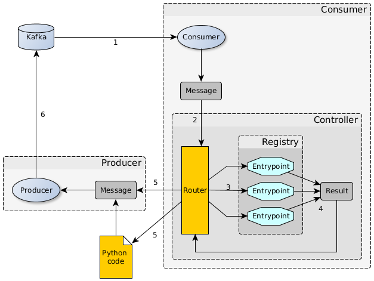

.. Kser documentation master file, created by
   sphinx-quickstart on Wed Feb 21 16:31:13 2018.
   You can adapt this file completely to your liking, but it should at least
   contain the root `toctree` directive.

Kser
====

Kser is a bundle of python library whose purpose is to serialize tasks to be
executed on Kafka consumers.

#. A message comes from Kafka.
#. Consumer deserialize message and send it to the "router" witch dispatch the message to the registry.
#. Registry loads the correct entrypoint based on the message content.
#. Registry execute the entrypoint with the message data and return a result.
#. Result is sent back to the router which dispatch it.
#. Result may be sent back to kafka using the Producer.

Features & API Focus
--------------------

.. toctree::
   :maxdepth: 1

   entry.rst
   crypto.rst
   sequencing.rst
   metrics.rst
   opentracing.rst