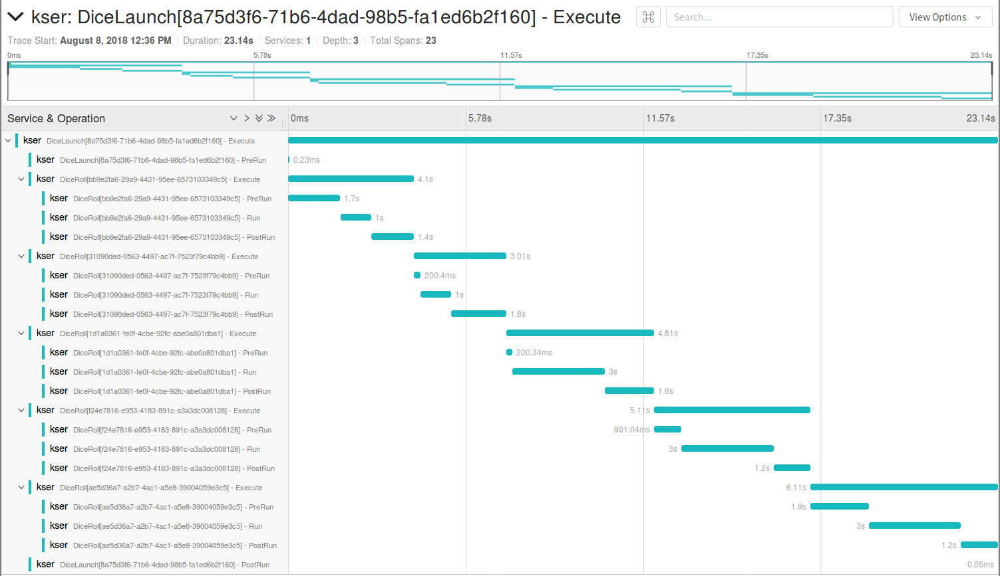

Opentracing support with Jaeger
===============================

Kser support `opentracing <http://opentracing.io/>`_ and
`Jaeger <https://www.jaegertracing.io/docs/>`_ to follow and display operation and task execution.

Install
-------

    $ pip install kser[opentracing]

Configuration
-------------

Configuration is done using environment variable:

.. table:: Configuration variable
   :widths: auto

   ======================= ================
     Environment variable   Default value
   ======================= ================
     JAEGER_HOST            localhost
   ======================= ================

Example
-------

.. note::

   We assume that you have a working jaeger...

The following example is based on a dice game, player roll five time dices:

.. code-block:: python
   :linenos:

   import logging

   logging.basicConfig(
       level=logging.DEBUG,
       format="%(asctime)s %(levelname)-8s %(message)s"
   )

   import time
   import random

   from cdumay_result import Result
   from kser.tracing.task import OpentracingTask
   from kser.tracing.operation import OpentracingOperation

   def contrived_time():
       time.sleep(random.randint(1, 20) / 10)

   class DiceRoll(OpentracingTask):
       def prerun(self):
           contrived_time()

       def run(self):
           launch = random.randint(1, 6)
           time.sleep(random.randint(1, 3))
           return Result(uuid=self.uuid, stdout="You made a {}".format(launch))

       def postrun(self, result):
           contrived_time()
           return result

   class DiceLaunch(OpentracingOperation):
       def build_tasks(self, **kwargs):
           return [
               DiceRoll(),
               DiceRoll(),
               DiceRoll(),
           ]

   if __name__ == '__main__':
       import os
       from jaeger_client import Config
       from cdumay_opentracing import OpenTracingManager
       from kser.entry import Entrypoint
       from kser.tracing.driver import OpenTracingKserDriver

       tracer = Config(service_name="test-kser", config=dict(
           sampler=dict(type='const', param=1), logging=True,
           local_agent=dict(reporting_host=os.getenv('JAEGER_HOST', 'localhost'))
       )).initialize_tracer()

       OpenTracingManager.register(Entrypoint, OpenTracingKserDriver)

       DiceLaunch().build().execute()
       time.sleep(4)
       tracer.close()

**Explanations**:

* **line 11-12**: as we can see, we use the specialized classes
  :class:`kser.tracing.operation.OpentracingOperation` and :class:`kser.tracing.task.OpentracingTask` based on
  :class:`kser.sequencing.operation.Operation` and :class:`kser.sequencing.task.Task`.
* **line 21/25/29**: we simulate execution time
* **line 50-53**: We initialize tracing using Jaeger.
* **line 55**: We register the Kser driver :class:`kser.tracing.driver.OpenTracingKserDriver` for subclass of :class:`kser.entry.Entrypoint`.
* **line 57**: We launch the operation :code:`DiceLaunch`.
* **line 59**: `yield to IOLoop to flush the spans <https://github.com/jaegertracing/jaeger-client-python/issues/50>`_
* **line 60**: we flush any buffered spans

**Console output**::

   2018-08-08 12:36:59,753 Initializing Jaeger Tracer with UDP reporter
   2018-08-08 12:36:59,754 Using sampler ConstSampler(True)
   2018-08-08 12:36:59,758 opentracing.tracer initialized to <jaeger_client.tracer.Tracer object at 0x7f1c7d59a668>[app_name=kser]
   2018-08-08 12:36:59,759 DiceLaunch.PreBuild: __main__.DiceLaunch[8a75d3f6-71b6-4dad-98b5-fa1ed6b2f160]: {}
   2018-08-08 12:36:59,760 DiceLaunch.BuildTasks: 5 task(s) found
   2018-08-08 12:36:59,760 DiceLaunch[8a75d3f6-71b6-4dad-98b5-fa1ed6b2f160] - PreRun
   2018-08-08 12:36:59,760 DiceLaunch.SetStatus: __main__.DiceLaunch[8a75d3f6-71b6-4dad-98b5-fa1ed6b2f160] status update 'PENDING' -> 'RUNNING'
   2018-08-08 12:36:59,760 Reporting span b72e015e7d14cf41:9ae003a32eafcc52:b72e015e7d14cf41:1 kser.DiceLaunch[8a75d3f6-71b6-4dad-98b5-fa1ed6b2f160] - PreRun
   2018-08-08 12:36:59,761 DiceRoll[bb9e2fa6-29a9-4431-95ee-6573103349c5] - PreRun
   2018-08-08 12:37:01,462 Reporting span b72e015e7d14cf41:411604082021b77a:3478b474ed615e6:1 kser.DiceRoll[bb9e2fa6-29a9-4431-95ee-6573103349c5] - PreRun
   2018-08-08 12:37:01,462 DiceRoll[bb9e2fa6-29a9-4431-95ee-6573103349c5] - Run
   2018-08-08 12:37:02,463 Reporting span b72e015e7d14cf41:af5d7ba4127a6f6c:3478b474ed615e6:1 kser.DiceRoll[bb9e2fa6-29a9-4431-95ee-6573103349c5] - Run
   2018-08-08 12:37:02,463 DiceRoll[bb9e2fa6-29a9-4431-95ee-6573103349c5] - PostRun
   2018-08-08 12:37:03,865 Reporting span b72e015e7d14cf41:cb0a705e20b36496:3478b474ed615e6:1 kser.DiceRoll[bb9e2fa6-29a9-4431-95ee-6573103349c5] - PostRun
   2018-08-08 12:37:03,865 DiceRoll.Success: __main__.DiceRoll[bb9e2fa6-29a9-4431-95ee-6573103349c5]: You made a 3
   2018-08-08 12:37:03,865 Reporting span b72e015e7d14cf41:3478b474ed615e6:b72e015e7d14cf41:1 kser.DiceRoll[bb9e2fa6-29a9-4431-95ee-6573103349c5] - Execute
   2018-08-08 12:37:03,866 DiceRoll[31090ded-0563-4497-ac7f-7523f79c4bb9] - PreRun
   2018-08-08 12:37:04,066 Reporting span b72e015e7d14cf41:c49fb0550bd27b25:1ec1d003a3d94c66:1 kser.DiceRoll[31090ded-0563-4497-ac7f-7523f79c4bb9] - PreRun
   2018-08-08 12:37:04,067 DiceRoll[31090ded-0563-4497-ac7f-7523f79c4bb9] - Run
   2018-08-08 12:37:05,067 Reporting span b72e015e7d14cf41:1be20968f7d6cc1f:1ec1d003a3d94c66:1 kser.DiceRoll[31090ded-0563-4497-ac7f-7523f79c4bb9] - Run
   2018-08-08 12:37:05,068 DiceRoll[31090ded-0563-4497-ac7f-7523f79c4bb9] - PostRun
   2018-08-08 12:37:06,870 Reporting span b72e015e7d14cf41:70c9928dd1f6e1df:1ec1d003a3d94c66:1 kser.DiceRoll[31090ded-0563-4497-ac7f-7523f79c4bb9] - PostRun
   2018-08-08 12:37:06,871 DiceRoll.Success: __main__.DiceRoll[31090ded-0563-4497-ac7f-7523f79c4bb9]: You made a 3
   2018-08-08 12:37:06,871 Reporting span b72e015e7d14cf41:1ec1d003a3d94c66:b72e015e7d14cf41:1 kser.DiceRoll[31090ded-0563-4497-ac7f-7523f79c4bb9] - Execute
   2018-08-08 12:37:06,871 DiceRoll[1d1a0361-fe0f-4cbe-92fc-abe0a801dba1] - PreRun
   2018-08-08 12:37:07,072 Reporting span b72e015e7d14cf41:f337f69f34da1345:c17278695688fe0d:1 kser.DiceRoll[1d1a0361-fe0f-4cbe-92fc-abe0a801dba1] - PreRun
   2018-08-08 12:37:07,072 DiceRoll[1d1a0361-fe0f-4cbe-92fc-abe0a801dba1] - Run
   2018-08-08 12:37:10,075 Reporting span b72e015e7d14cf41:304bef5db6be72c2:c17278695688fe0d:1 kser.DiceRoll[1d1a0361-fe0f-4cbe-92fc-abe0a801dba1] - Run
   2018-08-08 12:37:10,076 DiceRoll[1d1a0361-fe0f-4cbe-92fc-abe0a801dba1] - PostRun
   2018-08-08 12:37:11,677 Reporting span b72e015e7d14cf41:9499a64a4c55ebf:c17278695688fe0d:1 kser.DiceRoll[1d1a0361-fe0f-4cbe-92fc-abe0a801dba1] - PostRun
   2018-08-08 12:37:11,677 DiceRoll.Success: __main__.DiceRoll[1d1a0361-fe0f-4cbe-92fc-abe0a801dba1]: You made a 5
   2018-08-08 12:37:11,677 Reporting span b72e015e7d14cf41:c17278695688fe0d:b72e015e7d14cf41:1 kser.DiceRoll[1d1a0361-fe0f-4cbe-92fc-abe0a801dba1] - Execute
   2018-08-08 12:37:11,678 DiceRoll[f24e7816-e953-4183-891c-a3a3dc008128] - PreRun
   2018-08-08 12:37:12,579 Reporting span b72e015e7d14cf41:d2200a6f5b029a7f:942840d8feffd756:1 kser.DiceRoll[f24e7816-e953-4183-891c-a3a3dc008128] - PreRun
   2018-08-08 12:37:12,580 DiceRoll[f24e7816-e953-4183-891c-a3a3dc008128] - Run
   2018-08-08 12:37:15,580 Reporting span b72e015e7d14cf41:139b24d83aee44bf:942840d8feffd756:1 kser.DiceRoll[f24e7816-e953-4183-891c-a3a3dc008128] - Run
   2018-08-08 12:37:15,581 DiceRoll[f24e7816-e953-4183-891c-a3a3dc008128] - PostRun
   2018-08-08 12:37:16,782 Reporting span b72e015e7d14cf41:95fdaed9ade3b3f7:942840d8feffd756:1 kser.DiceRoll[f24e7816-e953-4183-891c-a3a3dc008128] - PostRun
   2018-08-08 12:37:16,783 DiceRoll.Success: __main__.DiceRoll[f24e7816-e953-4183-891c-a3a3dc008128]: You made a 4
   2018-08-08 12:37:16,783 Reporting span b72e015e7d14cf41:942840d8feffd756:b72e015e7d14cf41:1 kser.DiceRoll[f24e7816-e953-4183-891c-a3a3dc008128] - Execute
   2018-08-08 12:37:16,784 DiceRoll[ae5d36a7-a2b7-4ac1-a5e8-39004059e3c5] - PreRun
   2018-08-08 12:37:18,686 Reporting span b72e015e7d14cf41:bea78e6f943f7aa8:54941f4bb4657ec2:1 kser.DiceRoll[ae5d36a7-a2b7-4ac1-a5e8-39004059e3c5] - PreRun
   2018-08-08 12:37:18,687 DiceRoll[ae5d36a7-a2b7-4ac1-a5e8-39004059e3c5] - Run
   2018-08-08 12:37:21,690 Reporting span b72e015e7d14cf41:fc937aa7e2d633d3:54941f4bb4657ec2:1 kser.DiceRoll[ae5d36a7-a2b7-4ac1-a5e8-39004059e3c5] - Run
   2018-08-08 12:37:21,691 DiceRoll[ae5d36a7-a2b7-4ac1-a5e8-39004059e3c5] - PostRun
   2018-08-08 12:37:22,892 Reporting span b72e015e7d14cf41:c4393051442fdecc:54941f4bb4657ec2:1 kser.DiceRoll[ae5d36a7-a2b7-4ac1-a5e8-39004059e3c5] - PostRun
   2018-08-08 12:37:22,893 DiceRoll.Success: __main__.DiceRoll[ae5d36a7-a2b7-4ac1-a5e8-39004059e3c5]: You made a 6
   2018-08-08 12:37:22,893 Reporting span b72e015e7d14cf41:54941f4bb4657ec2:b72e015e7d14cf41:1 kser.DiceRoll[ae5d36a7-a2b7-4ac1-a5e8-39004059e3c5] - Execute
   2018-08-08 12:37:22,894 DiceLaunch[8a75d3f6-71b6-4dad-98b5-fa1ed6b2f160] - PostRun
   2018-08-08 12:37:22,894 Reporting span b72e015e7d14cf41:d31e32e75feaba57:b72e015e7d14cf41:1 kser.DiceLaunch[8a75d3f6-71b6-4dad-98b5-fa1ed6b2f160] - PostRun
   2018-08-08 12:37:22,894 DiceLaunch.SetStatus: __main__.DiceLaunch[8a75d3f6-71b6-4dad-98b5-fa1ed6b2f160] status update 'RUNNING' -> 'SUCCESS'
   2018-08-08 12:37:22,895 DiceLaunch.Success: __main__.DiceLaunch[8a75d3f6-71b6-4dad-98b5-fa1ed6b2f160]: You made a 6
   2018-08-08 12:37:22,895 Reporting span b72e015e7d14cf41:b72e015e7d14cf41:0:1 kser.DiceLaunch[8a75d3f6-71b6-4dad-98b5-fa1ed6b2f160] - Execute

**Display in jaeger**:

Select **kser** in the service list and click on you trace:

.. note::

   Only execution is traced

**Deeper**:

Kser allow you to create operation using another operation using
:code:`kser.tracing.operation.OpentracingOperation.compute_tasks()`. Computed tasks will be append to the operation span directly. The reuse the the previous code and append

.. code-block:: python
   :linenos:

   class Yahtzee(OpentracingOperation):
       def build_tasks(self, **kwargs):
           tasks = list()
           tasks += DiceLaunch().compute_tasks()
           tasks += DiceLaunch().compute_tasks()
           tasks += DiceLaunch().compute_tasks()
           return tasks

This will create a span with 3x5 tasks in it.

.. seealso::

   `cdumay-opentracing <https://github.com/cdumay/cdumay-opentracing>`_
      Library to facilitate opentracing integration

   `OpenTracing API for Python <https://github.com/opentracing/opentracing-python>`_
      Python library for OpenTracing.

   `jaeger-client-python <https://github.com/jaegertracing/jaeger-client-python>`_
      Jaeger Bindings for Python OpenTracing API